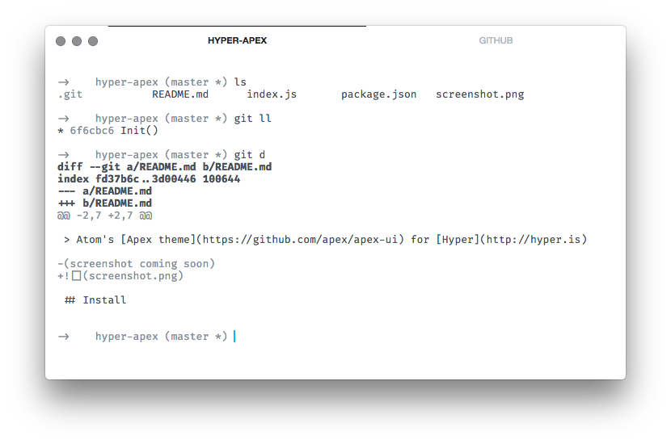

# hyper-apex

> Monochrome [Hyper](http://hyper.is) theme based on the [Apex Atom theme](https://github.com/apex/apex-ui).



## Install

1. Open Hyper preferences (`~/.hyper.js`)
2. Add `hyper-apex` to the plugins list:
```
plugins: [
  'hyper-apex'
],
```

## Credits

**[@tj](https://github.com/tj)** - original [Apex UI theme](https://github.com/apex/apex-ui) (+[syntax](https://github.com/apex/apex-syntax)) for [Atom](https://atom.io).
